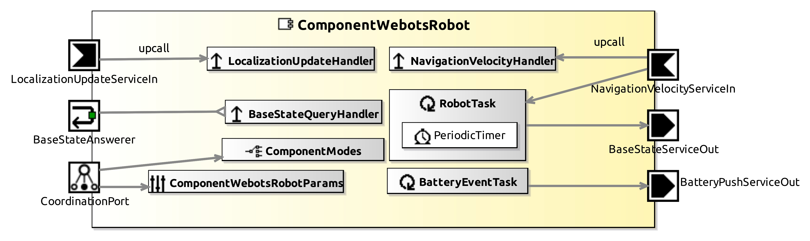

# AROSYS

 

## Components
The following components are new components for RobMoSys in order to be able to use them with the [Webots simulator](https://cyberbotics.com).

### ComponentWebots
This component allows the user to use Webots simulator instead of Gazebo, PlayerStage, etc. There exists a pre-requirement to use Webots. You have to execute this command once in a Terminal and restart the computer/Virtual Machine. Don't forget to adapt the path if necessary.
`echo -e "export WEBOTS_HOME=/home/smartsoft/SOFTWARE/webots" >> ~/.profile`

### ComponentWebotsRobots

This Component provides sensors raw data and it updates the robot controller. One must "Enable" the available sensor in component parameters. 

### ComponentWebotsBumper

This component configures bumper's sensors in SmartSoft according to Webots prototype sensors and provides the bumper value.

| Input  | Output |
| ------ | ------ |
|   | **BumperEventServiceOut**: bumber value |

### ComponentWebotsLidar

This component configures lidar's sensors in SmartSoft according to Webots prototype sensors and provides the sensor's data.

| Input  | Output |
| ------ | ------ |
| **BaseStateServiceIn**: state of the robot base (position and orientation) | **LaserServiceOut**: lidar values |

> **Note** : It is important to mentionned that the lidar range has to be under 65.535 meter otherwise it will be set at 65 meter because the variable type to store the value is `short`. This comes from source files generated by SmartMDSD. Maintainers will be alerted to this problem so that it can be improved.

### ComponentWebotsPioneer3DX
This component configures in SmartSoft the [Pioneer 3-DX](https://cyberbotics.com/doc/guide/pioneer-3dx) robot from Adept according to Webots prototype robot.

| Inputs  | outputs |
| ------- | ------- |
| **LocalizationUpdateServiceIn**: not implemented yet | **BatteryEventServiceOut**: not implemented yet |
| **NavigationVelocityServiceIn**: velocity commands (linear velocities and turnrate) | **BaseStateServiceOut**: state of the robot base (position and orientation) |

### ComponentWebotsRobotino3
This component configures in SmartSoft the [Robotino 3](https://cyberbotics.com/doc/guide/robotino3) robot from Festo according to Webots prototype robot.

| Inputs  | outputs |
| ------- | ------- |
| **LocalizationUpdateServiceIn**: not implemented yet | **BatteryEventServiceOut**: not implemented yet |
| **NavigationVelocityServiceIn**: velocity commands (linear velocities and turnrate) | **BaseStateServiceOut**: state of the robot base (position and orientation) |

### ComponentWebotsTIAGo
This component configures in SmartSoft all versions of TIAGo's  robot from Pal Robotics according to Webots prototype robot.

| Inputs  | outputs |
| ------- | ------- |
| **LocalizationUpdateServiceIn**: not implemented yet | **BatteryEventServiceOut**: not implemented yet |
| **NavigationVelocityServiceIn**: velocity commands (linear velocities and turnrate) | **BaseStateServiceOut**: state of the robot base (position and orientation) |
